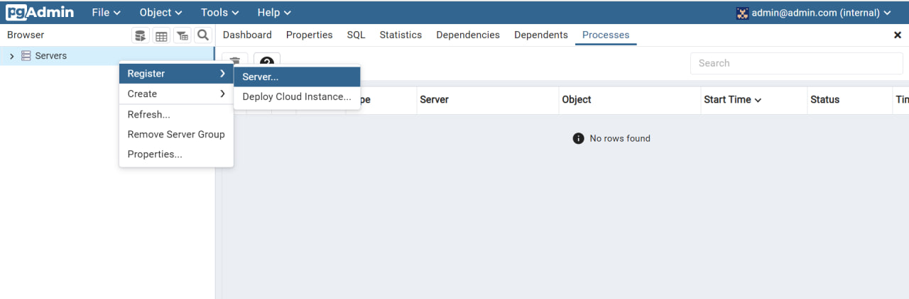
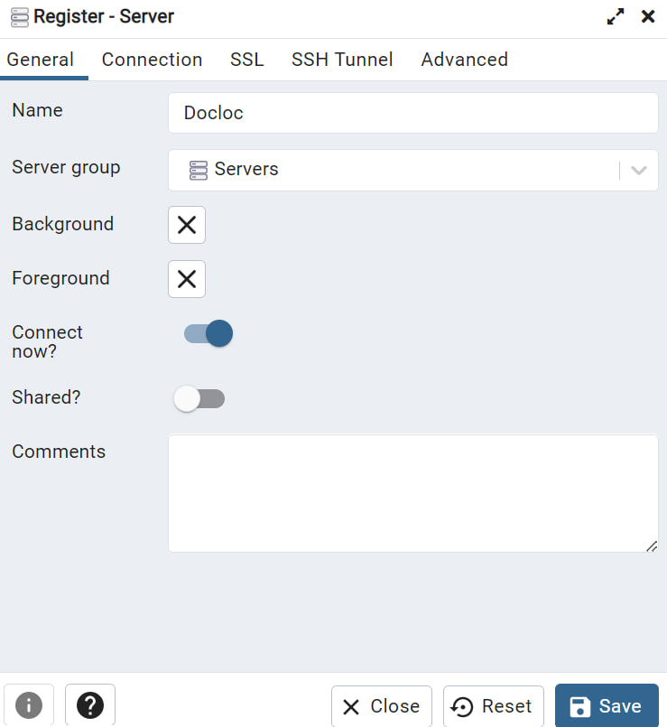
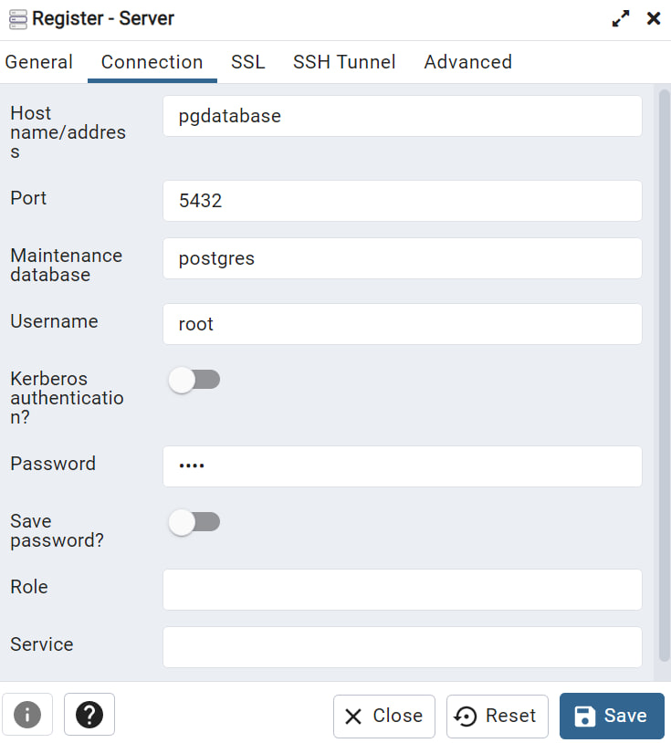

Задание повышенной сложности

Я написал docker-compose.yaml файл так, чтобы поднималась локально база данных Postgres и графический клиент pgAdmin для взаимодействия с базой данных.
После того, как контейнеры запущены командой ```docker compose up -d```, нужно открыть браузер и набрать ```http://localhost:8080/```.

Откроется окно, где нужно будет в поле логина ввести ```admin@admin.com```, а в поле пароля ввести ```root``` (просто потому что я так задал всё сам).

Далее нужно будет нажать на поле ```Server``` как на картинке и проделать все шаги так, как на последующих картинках:




